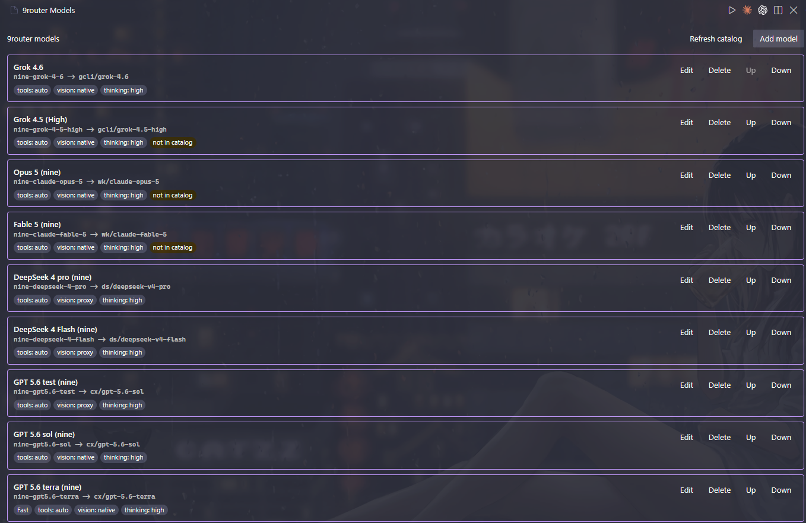
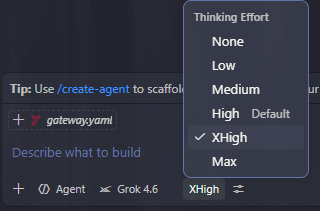
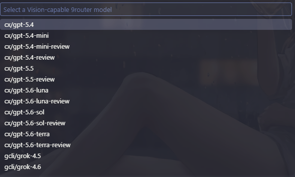
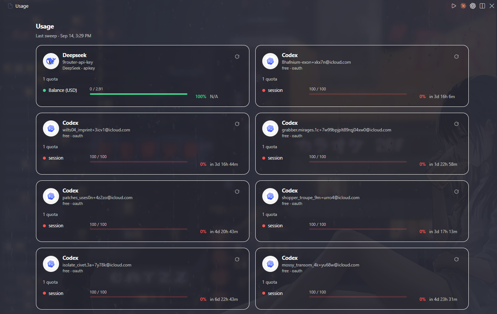

<p align="center">
  
</p>

<h1 align="center">9router for GitHub Copilot Chat</h1>

<p align="center">
  <strong>Your models. Your workflow. Native Copilot Chat.</strong><br>
  Use 9router models inside GitHub Copilot Chat without switching windows.
</p>

<p align="center">
  <a href="#quick-start">Quick start</a>
  &nbsp;·&nbsp;
  <a href="#feature-highlights">Features</a>
  &nbsp;·&nbsp;
  <a href="#everyday-commands">Commands</a>
  &nbsp;·&nbsp;
  <a href="#troubleshooting">Troubleshooting</a>
</p>

<p align="center">



</p>

## Why use it?

`9router` brings more model choice to Copilot Chat without adding another chat window or changing how you work in VS Code.

| Feature | What you get |
| --- | --- |
| **Stay in Copilot Chat** | Native chat, model picker, tools, and workspace context |
| **Your model lineup** | Add only the models you want, rename them, and set the order |
| **Thinking Effort** | Switch reasoning depth from chat when a model supports it |
| **Vision** | Send screenshots and diagrams natively or through a Vision proxy |
| **Agent tools** | Let compatible models use Copilot tools and project context |
| **Fast Tier** | Request faster service on supported models; look for the `⚡` badge |
| **Usage dashboard** | See remaining quota and reset times at a glance |
| **Private credentials** | Store your API key in VS Code SecretStorage |

## Quick start

**You need:** VS Code `1.133.0` or newer, GitHub Copilot Chat, a running 9router service, and a valid 9router API key.

### 1. Install

Install **9router Copilot Chat Provider** from the VS Code Extensions view, or download a VSIX from the project releases and choose **Extensions: Install from VSIX...**.

<details>
<summary>Prefer to build from source?</summary>

To build the VSIX from source, clone this repository, then run:

```bash
pnpm install
pnpm run package
code --install-extension 9router-copilot-chat-provider-0.12.0.vsix
```

</details>

Reload VS Code if `9router` does not appear in the Copilot Chat model picker.

### 2. Connect to 9router

Open the Command Palette and run:

1. `9router: Set API Key`
2. `9router: Test Connection`

The connection check confirms that 9router is reachable and reports available models without exposing your API key.

### 3. Add models

Run `9router: Manage Models`, then select **Add model**. Choose a model from 9router, customize its display name and capabilities, then save it.

Open GitHub Copilot Chat and choose the new model from the native model picker. No separate chat interface needed.

## Feature highlights

### Native Copilot experience

Models appear alongside other providers in GitHub Copilot Chat. Conversations keep native streaming, workspace context, tool calls, model selection, and cancellation behavior.

### Your model picker, your way

Create a focused list of models for coding, reasoning, image analysis, or everyday chat. Rename entries, reorder them, and remove models you no longer use. Broken entries stay visible in the manager so you can repair them without affecting valid models.

Use these commands:

- `9router: Manage Models` — view, edit, delete, and reorder models.
- `9router: Add Model` — open a blank model form immediately.
- `9router: Toggle Model Fast Tier` — request or stop requesting Fast Tier for one model.

### Thinking Effort

Choose how much reasoning a model should use for each request. Available levels can include `Minimal`, `Low`, `Medium`, `High`, `XHigh`, and `Max`, depending on model configuration. Select `None` when extra reasoning is unnecessary.

Reasoning can also appear as native thinking content when supported by your VS Code setup.

<p align="center">



</p>

### Vision

Use screenshots, diagrams, tables, and other images in chat through three per-model modes:

| Mode | How images are handled |
| --- | --- |
| **Native** | Send images directly to a Vision-capable model. |
| **Proxy** | Let a shared Vision model describe the image before your selected model answers. |
| **Off** | Block image input for that model. |

Run `9router: Configure Vision Proxy` to choose a Vision-capable 9router model or a GitHub Copilot model. Copilot model compatibility is checked when used. If setup is missing, the extension guides you when an image is first sent.

<p align="center">



</p>

### Tools and agent workflows

Enable tools for models that support them. Compatible models can participate in Copilot agent workflows and use available project tools while 9router remains responsible for model routing.

### Usage dashboard

Run `9router: Show Usage` or enter `@9router /usage` in chat. The dashboard shows connection quotas, remaining capacity, and reset timers without filling your conversation with usage data.

<p align="center">



</p>

### Safe diagnostics

Run `9router: Show Diagnostics` when something does not work. `minimal` and `metadata` diagnostics help identify connection, model, Vision, and configuration problems without recording prompts or secrets.

## Everyday commands

Open the **Command Palette** and search for `9router`.

| Command | What it does |
| --- | --- |
| `9router: Set API Key` | Securely save your 9router API key |
| `9router: Clear API Key` | Remove saved API key |
| `9router: Test Connection` | Check connection and model availability |
| `9router: Manage Models` | Add, edit, delete, and reorder models |
| `9router: Add Model` | Add a model directly |
| `9router: Toggle Model Fast Tier` | Toggle Fast Tier requests for a model |
| `9router: Configure Vision Proxy` | Select a Vision proxy source and model |
| `9router: Show Usage` | Open quota and usage dashboard |
| `9router: Show Diagnostics` | Open troubleshooting details |
| `9router: Export Codex Config` | Export models to Codex catalog/profile files |

Codex CLI export writes non-secret provider settings only. Set `NINE_ROUTER_API_KEY` in your environment before running Codex. Profile installs launch with `codex --profile 9router`.

## Advanced setup

<details>
<summary>Customize settings and per-model options</summary>

Most users can configure everything through commands. For manual control, open VS Code Settings and search for `9router Copilot`.

Important options include:

- **Base URL** — address of your 9router service.
- **Models** — ordered models shown in Copilot Chat.
- **Vision Proxy** — source, model, and image-analysis instructions.
- **Maximum response tokens** — optional response-length limit.
- **Request timeout** — maximum wait time for a request.
- **Debug mode** — choose `minimal`, `metadata`, or `verbose` diagnostics.

Each model can have its own display name, Fast Tier, tools, Vision mode, Thinking Effort choices, and context limits.

</details>

## Privacy and security

- API key stays in VS Code SecretStorage.
- `minimal` and `metadata` diagnostic modes avoid prompt content and secrets.
- Vision proxy failures stop the request before the main model runs, preventing incomplete image context from being used.
- API keys should never be placed in `settings.json`, `.env`, logs, screenshots, or documentation.

`verbose` diagnostics may include raw response data. Do not use or share verbose logs when working with sensitive content.

## Troubleshooting

<details>
<summary>Connection, model picker, Vision, and Thinking Effort help</summary>

- **9router is missing from the model picker** — reload VS Code, then run `9router: Test Connection`.
- **No models are available** — run `9router: Manage Models` and add at least one valid model.
- **Connection fails** — confirm that 9router is running, then set the API key again.
- **Image input is blocked** — edit the model and choose `Native` or `Proxy` Vision mode.
- **Vision proxy is missing** — run `9router: Configure Vision Proxy`.
- **Thinking Effort is unavailable** — edit the model and add supported effort choices.
- **More detail is needed** — run `9router: Show Diagnostics`.

</details>

## Development

<details>
<summary>Build, test, and debug the extension</summary>

```bash
pnpm install
pnpm run build
pnpm run test
pnpm run package
```

Press `F5` in VS Code to launch an Extension Development Host.

</details>

## Project scope

This extension connects GitHub Copilot Chat to 9router. It handles model selection, secure local settings, Vision and tool compatibility, streaming, usage display, and diagnostics. Model routing, fallbacks, quotas, and upstream execution remain managed by 9router.

## License

[MIT](./LICENSE)
